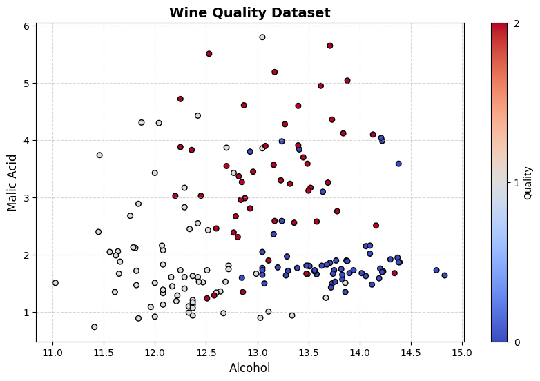

# Home Work - 2

# 🍷 Wine Quality Classification — Machine Learning Models

This project demonstrates **classification of wine quality** using classical ML algorithms in Python.  
The workflow covers visualization, dataset splitting, model training, and performance evaluation.
---

### 📊 Part 1: Visualize the Data
Below is a scatter plot showing the relationship between **Alcohol** and **Malic Acid** concentrations,  
colored by wine quality labels.

  

---

### 🧩 Part 2: Split the Data
The dataset was divided into **training** and **testing** subsets for model evaluation.
✅ Training set size: (124, 13)
✅ Testing set size: (54, 13)

### 🤖 Part 3: Model Training & Evaluation
Two supervised learning models were implemented:

| Model Type              | Description                                | Accuracy |
|--------------------------|--------------------------------------------|:--------:|
| **Decision Tree**        | Tree-based classifier capturing non-linear patterns | **0.96** |
| **Logistic Regression**  | Linear probabilistic model for classification | **0.98** |

# MNIST Classification + YOLOv5 Detection — Results

This project demonstrates **MNIST Classification Result using 3  different AI model and YOLOv5 Detection output 

## 📊 Model Accuracy Results

### Summary Table
| Model                    | Accuracy |
|--------------------------|:--------:|
| Random Forest            | 96.75%   |
| Logistic Regression      | 91.54%   |
| Neural Network (MLP)     | 97.12%   |

---

## 🖼️ Detection Output
Below is an example of the **detected image** produced by the YOLOv5 step.

> Path: `face_detection_result.png`

  

